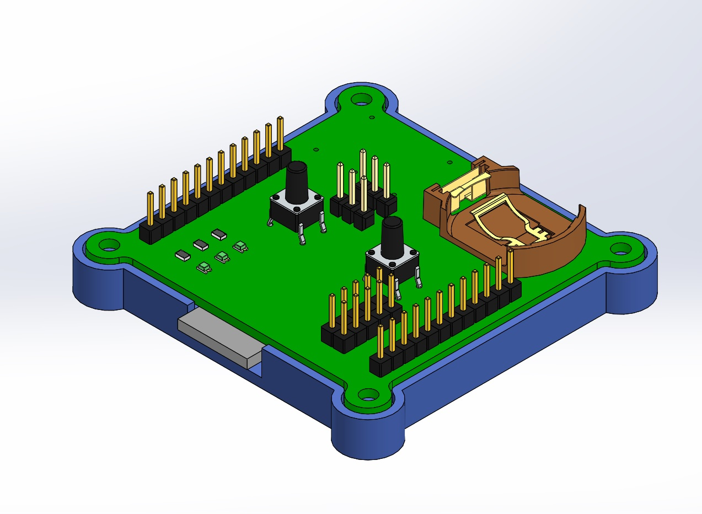

# CC2541Dev_board

My version of the development board for debugging microcontrollers of the cc254x series(JDY-08 module). The board is compatible with sample applications from Ti's BLE-STACK.

The board is designed to be manufactured on a CNC milling machine, and complies with 2nd class of accuracy.

  